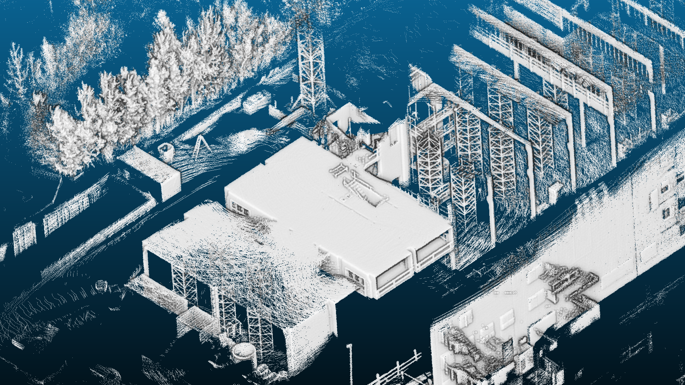

# Dense Cloud Creator
This package is used to transform point clouds from rosbags using poses from a pose file into a common coordinate frame and save them as a .pcd file. The grid size and the maximum number of points of the resulting global point cloud can be set by parameters. It is sufficient if poses are provided at 10 Hz, for example. The times between the poses are interpolated. Here [Barycentric Rational interpolation](https://live.boost.org/doc/libs/1_72_0/libs/math/doc/html/math_toolkit/barycentric.html) is used for the translations and slerp for the orientations.

<figure>

<figcaption>Fig.1 - Resulting dense point cloud of sequence Exp04 Construction Upper Level of the Hilti-Oxford Dataset.</figcaption>
</figure>

# Contents

- [Prerequisites](#prerequisites) 

- [Installation](#installation)

- [Setup](#setup)

- [Run](#run)

**Input:** Rosbags with LiDAR data (PointCloud2-Messages) and a Pose.txt file in TUM format

**Output:** Dense point cloud as .pcd file in the same frame

The package can work with LiDAR data from the following manufacturers (the ROS drivers must be configured in such a way that time stamp and ring id are provided for each point):

- Ouster
- Hesai
- Velodyne
- Robosense

If no timestamp per point is provided, "unknown" can be set and a timestamp based on the message header stamp is calculated.

## Prerequisites
The package was developed with the following packages:

- Ubuntu 20.04
- ROS Noetic
- Eigen 3.4.0

Compatibility with other Ubuntu/ROS/Eigen versions should be possible, but has not been tested.

### 1. Install ROS Noetic
Instructions for installing ROS Noetic can be found [here](http://wiki.ros.org/noetic/Installation). 

### 2. Update Eigen to Eigen 3.4.0
Unfortunately, Eigen 3.4.0 is not available via apt package management on Ubuntu 20.04. You can download the latest Eigen version from [here](https://eigen.tuxfamily.org/index.php?title=Main_Page) and follow the instructions.

You can also use the provided shell script, that will update your Eigen version to 3.4.0 on Ubuntu 20.04:

`sh helpers/updateEigenUbuntu20.04.sh`

## Installation

### 1. Create workspace:
`mkdir catkin_ws`
### 2. Create source folder:
`cd catkin_ws && mkdir src && cd src`
### 3. Clone repository:
`git clone https://github.com/davidskdds/dense_cloud_creator.git`
### 4. Compile
`cd .. && catkin_make`

## Setup
The settings are defined in `config/dense_cloud_settings.yaml`.

### 1. Rosbag Directories (bag_dirs)
The software processes the data directly from the Rosbag, there is no need to run "`rosbag play ...`". The path to the Rosbag must be specified to process the data.

A Rosbag path could look like this:
`bag_dirs: "/home/user_name/recording.bag"`

Several Rosbags can also be processed directly one after the other. To do this, the rosbag names are separated by spaces:
`bag_dirs: "/home/username/recording1.bag /home/username/recording2.bag"`

**Attention:** The path to a Rosbag or the Rosbag file name must not contain a space character

### 2. Pose File Directory (pose_file_dir)
This directory defines which pose file is used to transform to point to the map frame.
The poses inside the file must be in TUM format:

`timestamp tx ty tz qx qy qz qw`

### 3. Output Directory (result_dir)
This parameter defines, where the resulting dense point cloud is saved as "DensePointCloud.pcd".
It is recommended to use home directory (or another folder within home directory) to prevent permission issues.
The parameter could be set like this:

`result_dir: "/home/USERNAME"`

### 4. LiDAR and Extrinsics Settings
Regarding the LiDAR the `sensor` type {"hesai","ouster","robosense","velodyne","unknown"} and the `lidar_topic` must be specified in the .yaml file.
If the provided poses in pose_file_dir are not defined w.r.t. the LiDAR frame, a static extrinsic transform can be applied.

### 5. Dense Point Cloud Settings
To control the density and to limit the maximum size of the resulting point cloud two parameters are provided:

`grid_size`: controls the point density of the resulting cloud

`max_num_points`: defines the maximum number of points of the resulting point cloud

## Run

### 1. Source Workspace:
`source devel/setup.bash`

### 2. Run Package:
`roslaunch dense_cloud_creator dense_cloud_creator.launch`

After the package is started, RViz opens and displays the progress of the processing.
